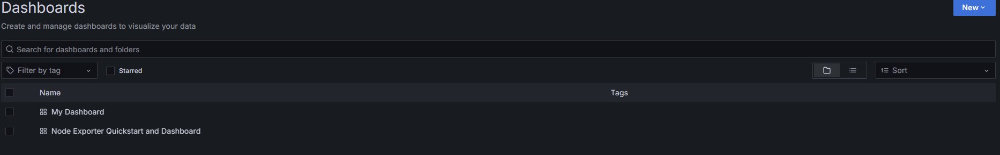

1. Установил готовый дашборд Node Exporter Quickstart and Dashboard с официального сайта Grafana Labs

2. Провел те же тесты, что и в Части 7

3. Запустил еще одун виртуальную машину, находящуюся в одной сети с текущей, запустил тест нагрузки сети с помощью iperf3

4. Посмотрел на нагрузку сетевого интерфейса

