1. Установил docker

2. Взял официальный докер-образ с nginx и выкачал его при помощи **docker pull**

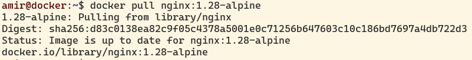

3. Проверил наличие докер-образа с помощью **docker images**

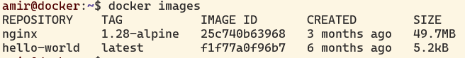

4. Запустил докер-образ с помощью **docker run -d**

5. Проверь, что образ запустился через **docker ps**

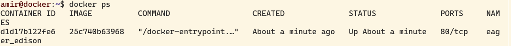

6. Посмотрел информацию о контейнере через **docker inspect**

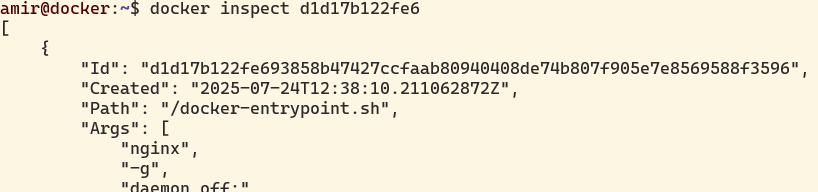

7. По выводу команды определил размер контейнера, список замапленных портов и ip контейнера

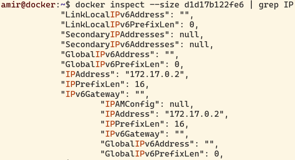

8. Остановил контейнер с помощью **docker stop**

9. Проверил, что контейнер остановился через **docker ps**

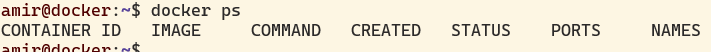

10. Запустил докер с портами 80 и 443 в контейнере, замапленными на такие же порты на локальной машине, через команду **run**

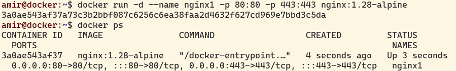

11. Проверил, что в браузере по адресу **localhost:80** доступна стартовая страница **nginx**

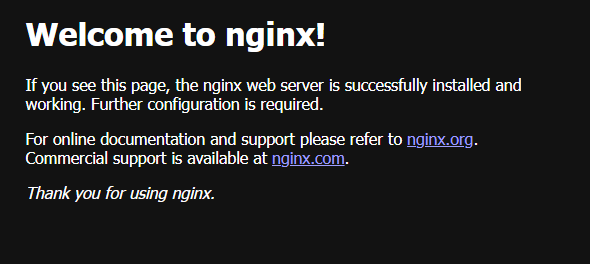

12. Перезапустил и проверил. что докер контейнер запустился через **docker restart**

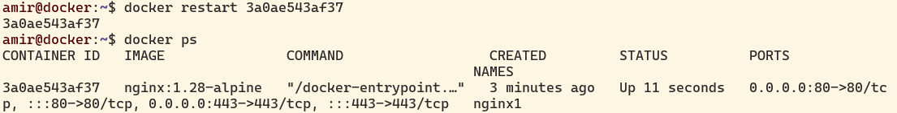

1. Прочитал конфигурационный файл **nginx.conf** внутри докер контейнера через команду *docker exec -ti nginx1 sh*

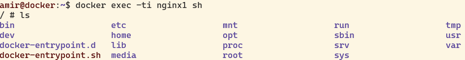

2. Создал на локальной машине файл **nginx.conf**

3. Настроил в нем по пути _/status_ отдачу страницы статуса сервера **nginx**

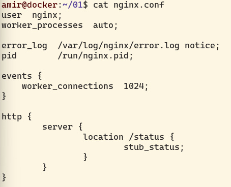

4. Скопировал созданный файл **nginx.conf** в докер контейнер через команду **docker cp**

5. Перезапустил **nginx** внутри докер-образа через команду **exec**

6. Проверил, что по адресу _localhost:80/status_ отдается страничка со статусом сервера **nginx**.

7. Экспортировал контейнер в файл _container.tar_ через команду **export**

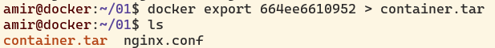

8. Остановил контейнер

9. Удалил остановленный контейнер

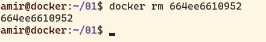

10. Удали образ через *docker rmi [image_id|repository]*, не удаляя перед этим контейнеры

11. Импортируй контейнер обратно через команду **import**

12. Запустил импортированный контейнер

13. Проверил , что по адресу _localhost:80/status_ отдается страничка со статусом сервера **nginx**

1. Установил зависимости для работы  **C** и **FastCgi**
2. Напиши мини-сервер на **C** и **FastCgi**, который будет возвращать простейшую страничку с надписью `Hello, World!`

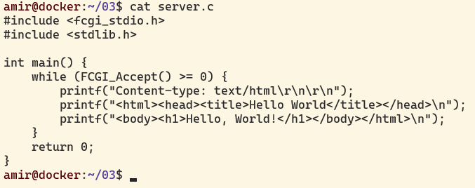

3. Запустил написанный мини-сервер через _spawn-fcgi_ на порту 8080

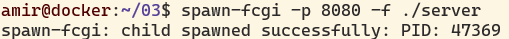

4. Написал свой _nginx.conf_, который будет проксировать все запросы с 81 порта на _127.0.0.1:8080_

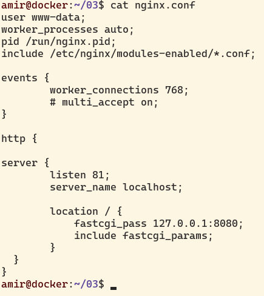

5. Запустил локально **nginx** с написанной конфигурацией

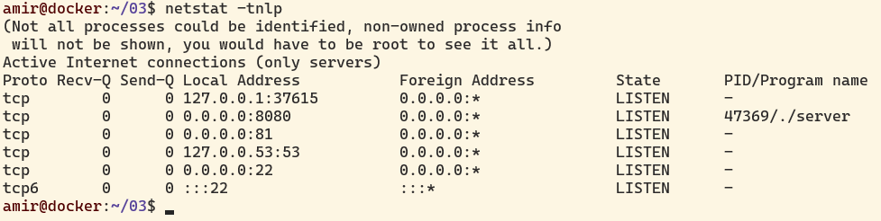

6. Проверил, что в браузере по _localhost:81_ отдается написанная тобой страничка

7. Положил файл _nginx.conf_ по пути _./nginx/nginx.conf_

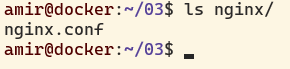

1. Написал свой докер-образ, который:
    1) собирает исходники мини сервера на FastCgi из [Части 3];
    2) запускает его на 8080 порту;
    3) копирует внутрь образа написанный _./nginx/nginx.conf_;
    4) запускает **nginx**.

2. Собрал написанный докер-образ через **docker build** при этом указав имя и тег

3. Проверил через **docker images**, что все собралось корректно

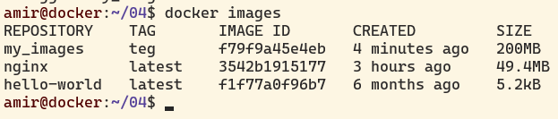

4. Запустил собранный докер-образ с маппингом 81 порта на 80 на локальной машине и маппингом папки _./nginx_ внутрь контейнера по адресу, где лежат конфигурационные файлы **nginx**'а

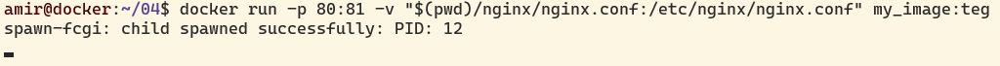

5. Проверил, что по *localhost:80* доступна страничка написанного мини сервера.

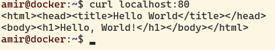

6. Дописал в _./nginx/nginx.conf_ проксирование странички _/status_, по которой надо отдавать статус сервера **nginx**. Пересобрал докер-образ. Проверил, что теперь по _localhost:80/status_ отдается страничка со статусом **nginx**

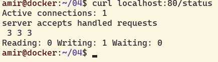

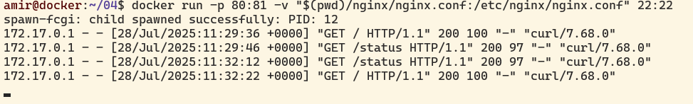

1. Просканировал образ из предыдущего задания через *dockle [image_id|repository]*

    1) Это предупреждение CIS-DI-00051 указывает, что контейнер запускается от имени root, что нарушает принцип минимальных привилегий.

    2) Это предупреждение CIS-DI-0005 указывает на необходимость активировать Docker Content Trust для проверки цифровых подписей образов.

    3) Это предупреждение CIS-DI-0006 означает, что в вашем Docker-образе отсутствует инструкция HEALTHCHECK, которая проверяет работоспособность контейнера.

2. Исправил образ так, чтобы при проверке через **dockle** не было ошибок и предупреждений

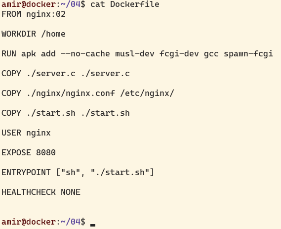

    1) Добавил непривилегированного пользователя, который встроен в докер-образ nginx
    
    2) Убрал проверку HEALTHCHECK
    
    3) Проигнорировал CIS-DI-0005 ошибку, потому что ее не исправить без установленного dockle на систему

1. Написал файл **docker-compose.yml**
2. Замапил 8080 порт второго контейнера на 80 порт локальной машины внутри *docker-compose* файла 

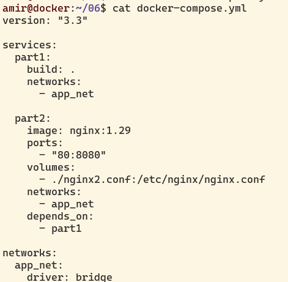

3. Останови все запущенные контейнеры

4. Собери и запусти проект с помощью команд **docker-compose build** и **docker-compose up**

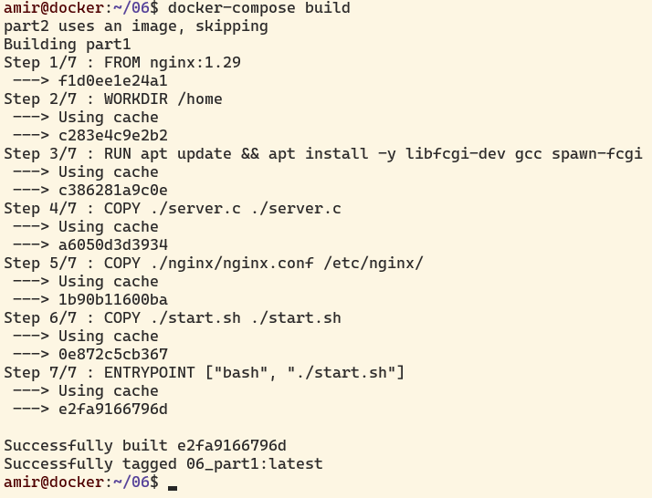

5. Проверь, что в браузере по _localhost:80_ отдается написанная тобой страничка, как и ранее

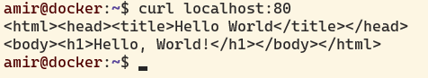

