## Part 1. Установка ОС

- Установил **OS Ubuntu 20.04 Server LTS** без графического интерфейса
- Программа для виртуализации — **VirtualBox ver. 7.1.8**
- Выполнил команду **`cat /etc/issue`**

## Part 2. Установка ОС

- Добавил нового пользователя - **`sudo adduser amir`**
- Добавил пользователя в группу adm - **`sudo usermod -aG adm amir`**
- Проверил, что пользователь добавлен в группу - **`groups amir`** 

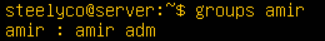

- Вывел список пользователей - **`cat /etc/passwd`**  

## Part 3. Настройка сети ОС

- Поменял имя машины на steelyco-1 - **`hostnamectl set-hostname steelyco-1`**
	1. Проверил название хоста   
	
	2. Переименовал  
	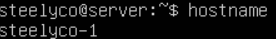
- Установил временную зону МСК - **`sudo timedatectl set-timezone Europe/Moscow`**  
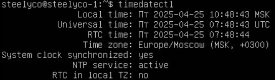
- Вывел название сетевых интерфейсов - **`ip link show`** 

- Вывел ip адрес устройства от DHCP-сервера - **`sudo dhclient -v`** 

- Вывел внешний и внутренний ip адрес шлюза - **`curl ifconfig.me`**, **`ip route show`** 
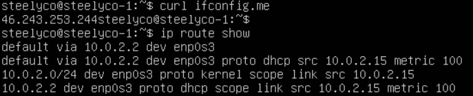
- Задал статичные настройки ip, gw, dns: 
	1. Открыл с помощью редактора vim файл *`/etc/netplan/00-installer-config.yaml`* 
	
	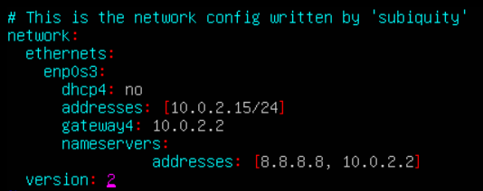
	
	2. Сохранил и применил новые настройки сети - **`sudo netplan apply`**
	3. Перезагрузил виртуальную машину - **`reboot`**
	4. Проверил настройки сети: 
	
	

- Перезагрузил и пропинговал удаленные хосты - **`ping 1.1.1.1`**, **`ping ya.ru`** 

- **Интерфейс lo** -  (loopback) присутствует на всех системах. Он используется для тестирования и диагностики сетевых приложений и служб на локальном компьютере.
- **Основные функции интерфейса lo:**
	1. Позволяет программам на одном и том же компьютере общаться друг с другом через сетевые протоколы, как если бы они находились на разных машинах.  
	2. Используется для тестирования сетевых приложений без необходимости подключения к внешней сети.
**Основные функции DHCP:**
- Автоматическое назначение IP-адресов: DHCP-сервер автоматически назначает IP-адреса устройствам, подключенным к сети.  
- Управление IP-адресами: DHCP-сервер отслеживает, какие IP-адреса уже назначены, и гарантирует, что каждый адрес уникален в пределах сети.  
- Обновление конфигурации: DHCP позволяет легко обновлять сетевые настройки устройств, например, при изменении DNS-серверов или шлюза.

**Преимущества использования DHCP:**
- Упрощение администрирования сети: Нет необходимости вручную настраивать каждый компьютер. 
- Гибкость: легко изменять сетевые параметры для всех устройств в сети. 
- Эффективное использование IP-адресов: DHCP-сервер может повторно использовать IP-адреса, которые больше не используются.

## Part 4. Обновление ОС

- Проверка обновления новых системных пакетов - **`sudo apt update`** 

- Обновление пакетов - **`sudo apt upgrate`** 
- Повторная проверка - **`sudo apt update`** 

## Part 5. Использование команды sudo

- Добавил пользователя в группу sudo - **`sudo usermod -aG sudo amir`** 

- Сменил пользователя командой sudo - **`sudo su - amir`** 

- Сменил *hostname* от пользователя *amir* созданного в *Part 2* - **`sudo hostnamectl sethostname amirserv`** 

- **Основные преимущества использования sudo:**
	- Безопасность: Вместо того чтобы постоянно работать под учетной записью root, пользователи могут временно получать привилегии суперпользователя только для выполнения конкретных команд. Это снижает риск случайных или вредоносных изменений в системе.
    
	- Аудит и контроль: Все команды, выполненные с использованием sudo, записываются в журнал, что позволяет администраторам отслеживать действия пользователей и выявлять потенциальные проблемы.
    
	- Гибкость: Администраторы могут настроить файл конфигурации /etc/sudoers, чтобы предоставить разные уровни доступа различным пользователям или группам пользователей.

## Part 6. Установка и настройка службы времени

- Вывел время часового пояса МСК - **`timedate`**, **`timedatectl`** 

## Part 7. Установка и использование текстовых редакторов

- Установил текстовые редакторы - **`sudo apt install vim`**, **`sudo apt install nano`**, **`sudo apt install joe`** 
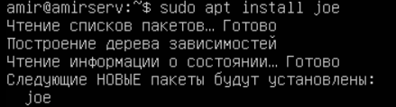

- Создал три текстовых документа - **`touch`** 

- Для того чтобы выйти из редактора *vim* с сохранением использовал **`:wq`** 

-  Для того чтобы выйти из редактора *nano* с сохранением использовал **`CTRL+O`, `CTRL+X`** 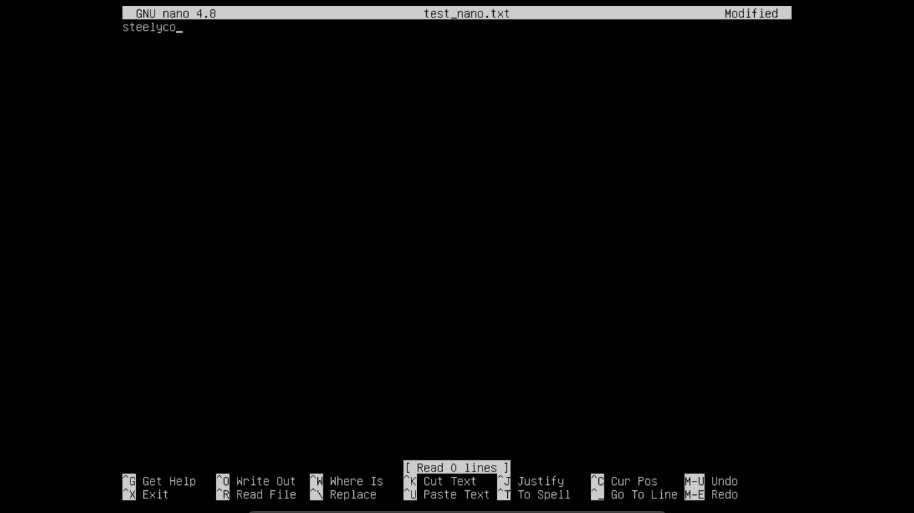
- Для того чтобы выйти из редактора *joe* с сохранением использовал **`CTRL+K D`**, **`CTRL+K X`** 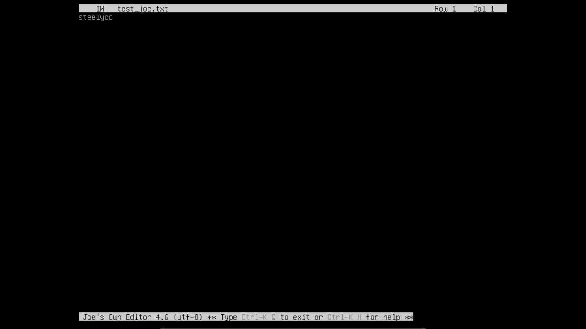
- Выход без сохранений *vim* - **`:q!`** 

- Выход без сохранений *nano* - **`CTRL+X`**, **`n`** 

- Выход без сохранений *joe* - **`CTRL+C`**, **`y`** 
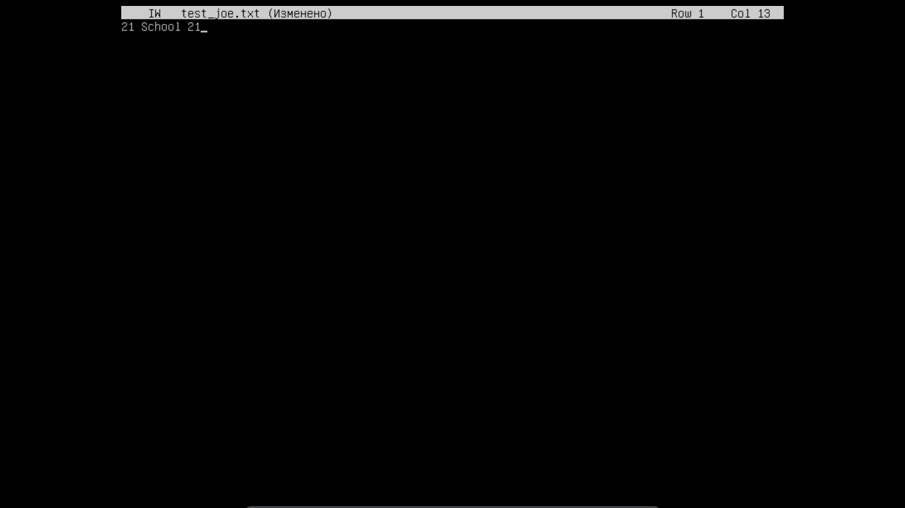
- Поиск и замена *vim* - **`/`**,  **`:s/старое/новое`** 

- Поиск и замена *nano* -  **`Ctrl+W`**, **`Ctrl+\`**, **`Y`**  
 

- Поиск и замена *joe* - **`Ctrl+K F`**, **`R`**, **`Y`** 
 
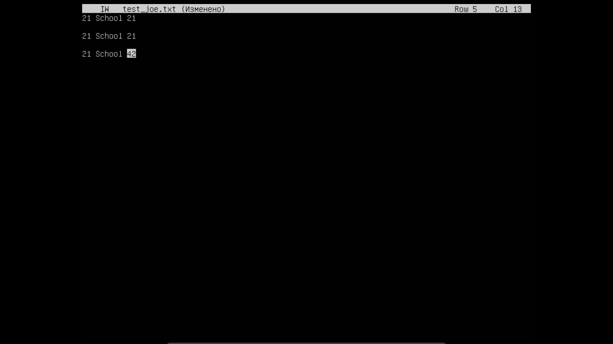

## Part 8. Установка и базовая настройка сервиса SSHD

- Установил службу SSHd - **`sudo apt install openssh-server`** 

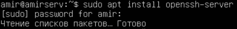

- Добавил службу SSHd в автозагрузку - **`sudo systemctl enable ssh`** 

- Проверил автозагрузку - **`sudo systemctl is-enabled ssh`**  

- Перенастроил службу SSHd на порт 2022 в файле */etc/ssh/sshd_config* - **`sudo vim /etc/ssh/sshd_config`** 

- Применил настройку sshd - **sudo systemctl restart ssh**
- Используя команду **`ps`** отобразил наличие процесса *sshd* 

- Установил *net-tools*, чтобы заработала команда *netstat* - **`sudo apt install net-tools`** 
- Вывел команду **`netstat -tan`** 

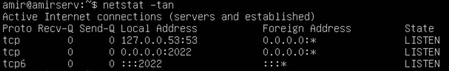

- **Пояснение команды `ps` и ключей:**

	1. Команда **`ps`** отображает информацию о текущих процессах, запущенных на системе. Она позволяет получать информацию о процессах, таких как идентификатор процесса (PID), использование CPU и оперативной памяти, время работы и многое другое. 
	
	2.  **`a`** - ключ, который указывает команде **`ps`** отобразить процессы всех пользователей, а не только текущего пользователя. Это позволяет увидеть процессы, которые запущены другими пользователями системы. 
    
	3. **`u`** - ключ, который выводит более подробную информацию о процессах, включая имя пользователя, использующего процесс, и использование ресурсов (CPU и память).
    
	4. **`x`** - ключ, который показывает процессы, не привязанные к терминалу. Это полезно, чтобы увидеть все процессы, даже те, которые не находятся в интерактивных сеансах.
    
	5. **`grep sshd`** - это команда, которая фильтрует вывод предыдущей команды **`ps aux`**, выводя только те строки, которые содержат слово **`sshd`**. **`sshd`** - это демон SSH (Secure Shell), который отвечает за прием входящих SSH-соединений.
- **Команда `netstat`:** - это инструмент для мониторинга сетевых соединений на сервере:
	1. Разбор ключей **`-tan`** 
		- **`-t`**: Этот ключ указывает команде **`netstat`**, что нужно отображать только соединения протокола TCP. То есть, вы будете видеть только TCP-соединения, игнорируя другие протоколы (например, UDP). 
		- **`-a`**: Этот ключ сообщает **`netstat`** показать все соединения и сокеты, включая установленные соединения и прослушивающие порты. 
		- **`-n`**: Этот ключ заставляет **`netstat`** показывать адреса и порты в числовом формате, а не преобразовывать их в человеко-читаемые имена (например, вместо того, чтобы показывать доменные имена, будет отображаться IP-адрес).
	2. Значение каждого столбца: 
		- *Proto*: Протокол, используемый для соединения (например, TCP).
		- *Recv-Q*: Количество байтов, ожидающих чтения в очереди приёма. Если значение больше 0, это может указывать на то, что приложение не читает данные. 
		- *Send-Q*: Количество байтов, ожидающих отправки в очереди передачи. Значение больше 0 может указывать на проблемы с сетью или приёмником, принимающим данные. 
		- *Local Address*: Локальный адрес и порт, на которых ваше приложение слушает или с которым оно установило соединение. Например, **`0.0.0.0:22`** означает, что служба прослушивает на порту 22 на всех доступных интерфейсах.
		- *Foreign Address*: Адрес и порт удалённого соединения. Если соединение не активно, поле может содержать символ **`*`**.
		- *State*: Состояние соединения. Примеры состояний: - **`LISTEN`**: сокет ожидает входящие соединения. - **`ESTABLISHED`**: соединение активно и данные могут передаваться.
- **Значение `0.0.0.0`** - **`0.0.0.0`** в выводе указывает на то, что сервис принимает соединения на всех доступных сетевых интерфейсах. Это значит, что он будет принимать соединения не только с локального хоста, но и с любых удалённых адресов. Это часто используется для служб, которые должны быть доступны из любого места. 

## Part 9. Использование утилит top, htop

- Установил утилиту **`top`** и **`htop`** 

 

- Вывод команды **`top`**: 
	1. Uptime - **`23 min`**
	2. Количество авторизованных пользователей - **`1 user`**
	3. Среднюю загрузку системы - **`0.00, 0.01, 0.00`**
	4. Общее количество процессов - **`119`**
	5. Загрузку cpu - **`0.0 us`** и **`0.0 sy`**
	6. Загрузку памяти - **`3919.4 total`**, **`173.6 used`**
	7. Pid процесса занимающего больше всего памяти - **`723`** - **`Shift + M`**
	8. Pid процесса, занимающего больше всего процессорного времени - **`1357`** 

	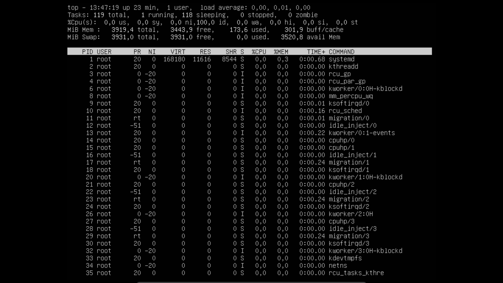

- Вывод команды **`htop`**: 

	1. **`PID`**: 
	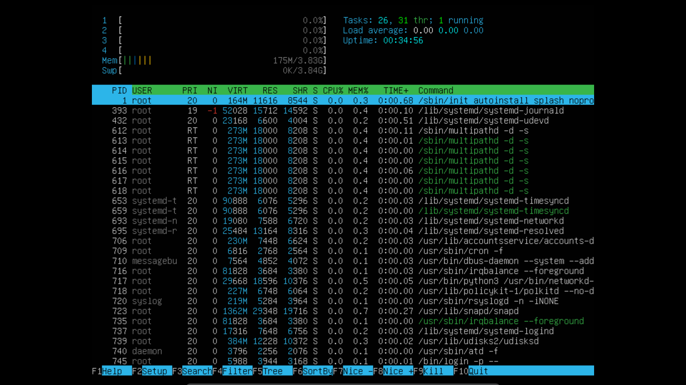
	2. **`PERCENT_CPU`**: 
	
	3. **`PERCENT_MEM`**: 
	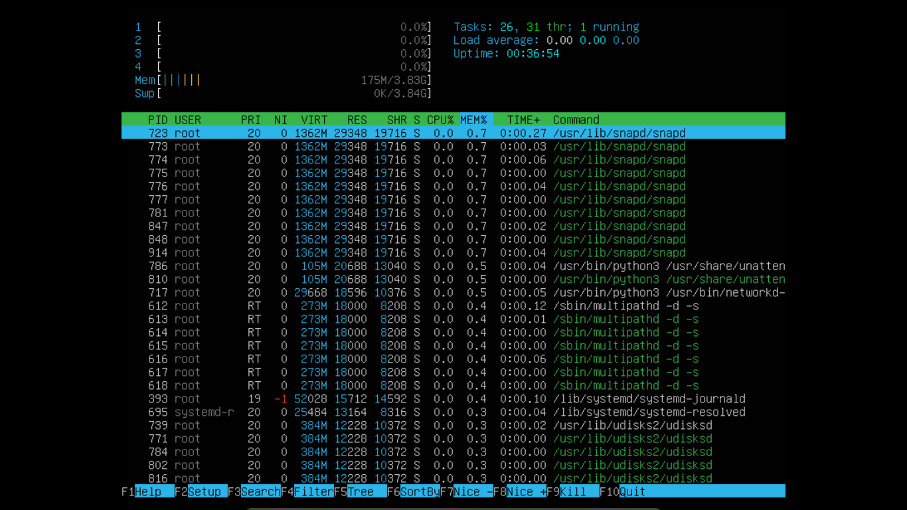
	4. **`TIME`**: 
	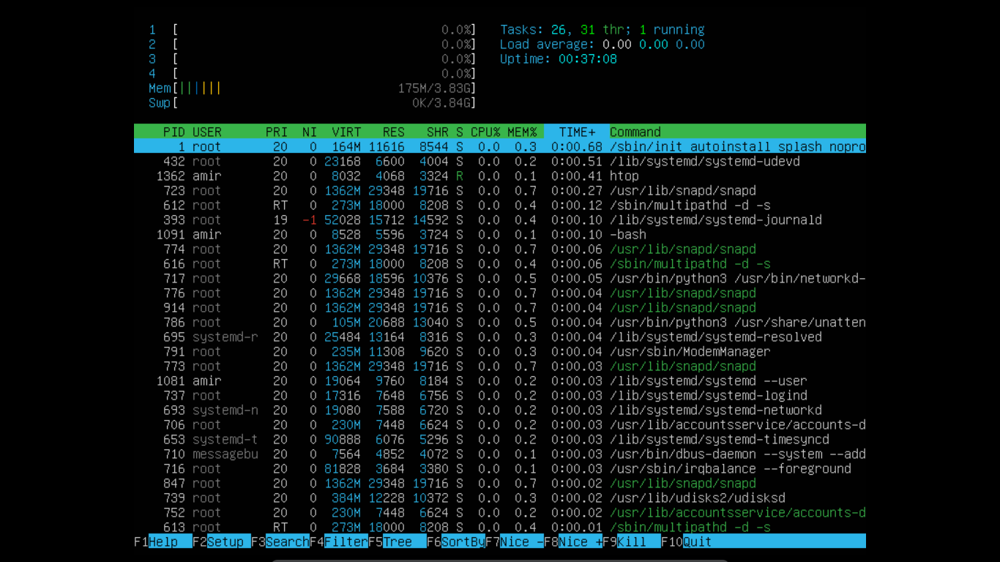
	5. **`sshd`**: 
	
	6. **`syslog`**: 
	
	7. **`hostname, clock и uptime`**: 

	

## Part 10. Использование утилиты fdisk

- Запустил команду **`fdisk -l`** 
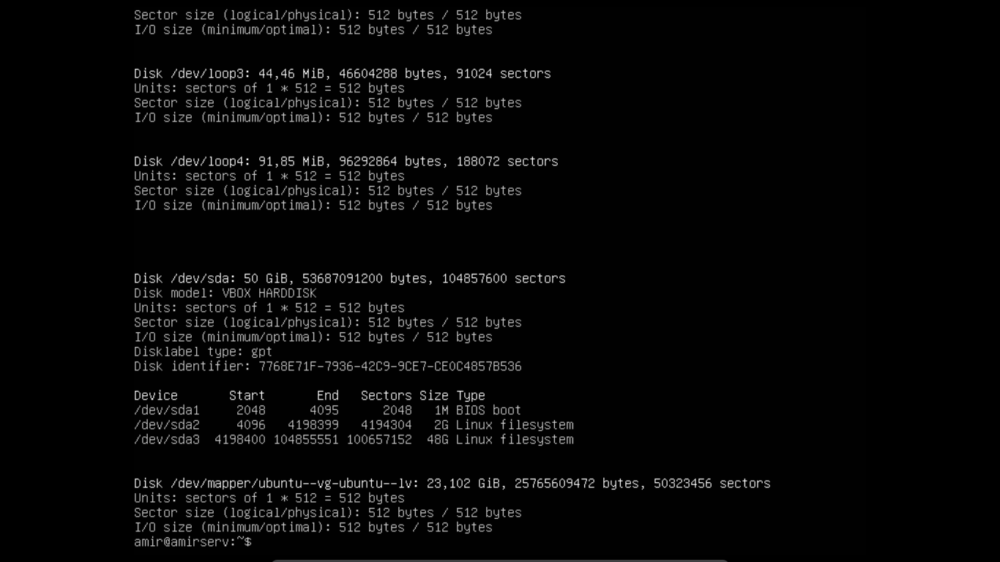
- Название жесткого диска - *sda*
- Размер - *50 GB*
- Количество секторов - *104857600*
- Размер swap - *3,9 GB* - **`swapon`**

## Part 11. Использование утилиты df

- Запустил команду **`df`**: 

	1. Размер раздела - *24590672 KB*
	2. Размер занятого пространства - *6779076 KB*
	3. Размер свободного пространства - *16537128 KB*
	4. Процент использования - *30%*
- Запустил команду **`df -Th`**: 

	1. Размер раздела - *25 GB*
	2. Размер занятого пространства - *6.5 GB*
	3. Размер свободного пространства - *16 GB*
	4. Процент использования - *30%*
- Тип файловой системы - **`ext4`** 

## Part 12. Использование утилиты du

- Запустил команду **`du`** 

- Размер папок */home, /var, /var/log* в байтах 

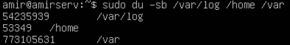

- Размер папок */home, /var, /var/log* в человеческом виде 

-  Размер каждого файла в */var/log* 

## Part 13. Использование утилиты ncdu

- Установил *ncdu* - **`sudo apt install ncdu`** 

- Вывод папок */home, /var, /var/log* 
 
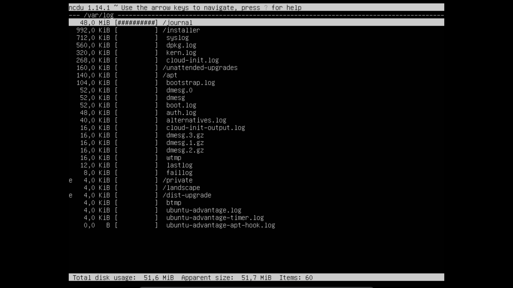 

## Part 14. Работа с системными журналами

- */var/log/dmesg* 

- */var/log/syslog* 
До перезапуска **`sshd`** После перезапуска **`sshd`** 
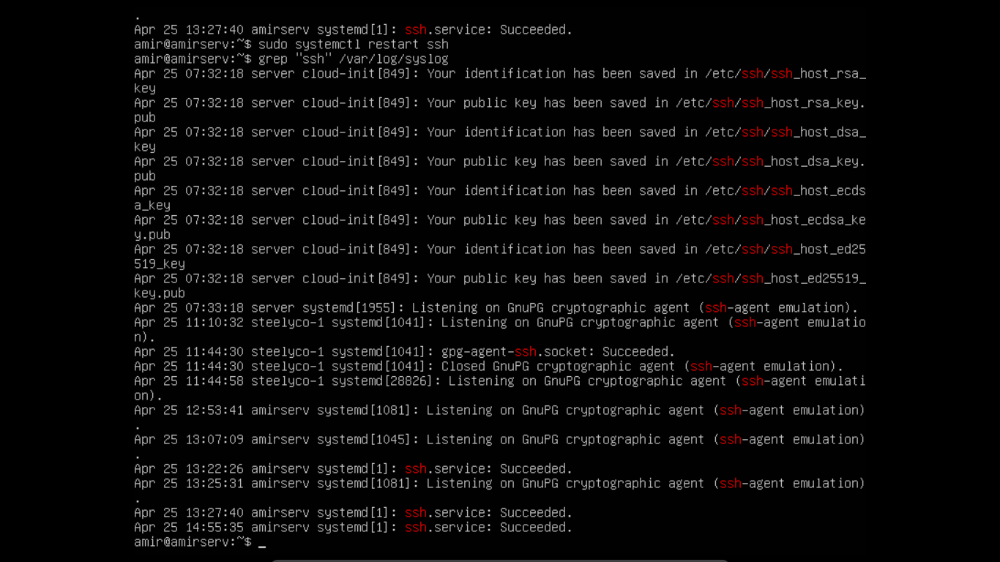
- */var/log/auth.log* 

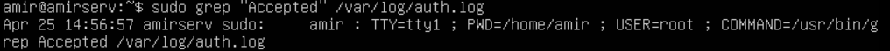

	1. Время успешной авторизации - Apr 25 15:56:57 
	2. Имя пользователя - amir
	3. Метод входа в систему - tty1

## Part 15. Использование планировщика заданий CRON

- Открыл и добавил команду *uptime* каждые две минуты в файл *crontab* 

- Вывод в логах то, что срабатывает *uptime* каждые две минуты 

 