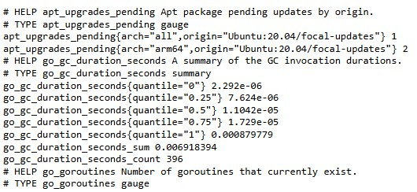
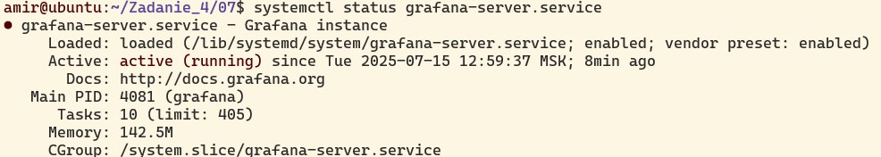
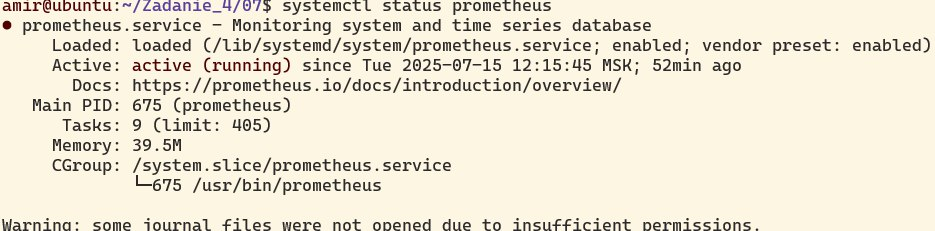
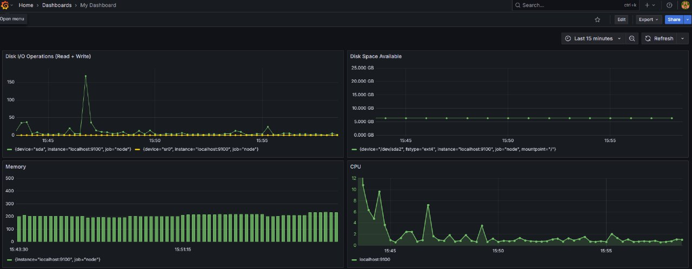
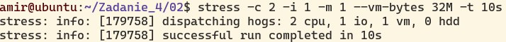
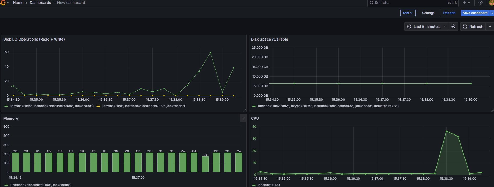

1. Установил Prometheus, Prometheus Node Exporter, Grafana 
2. Получил доступ к веб-интерфейсам Prometheus, Grafana с локальной машины

3. Добавил на Дашборд отображение ЦПУ, доступнйо оперативной памяти, свободного места и количества операций ввода/вывода на жестком диске

4. Запустил скрипт из Части 2

5. Установил утилтиту stress и заупститл команду stress -c 2 -i 1 -m 1 --vm-bytes 32M -t 10s

6. Посмотрел на нагрузку жесткого диска, оперативной памяти и ЦПУ

