Поднял виртуальную машину _Ubuntu Server 22.04 LTS_.

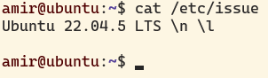

Скачал и установил на виртуальную машину **gitlab-runner**.

Запустил **gitlab-runner** и зарегистрируй его для использования в текущем проекте (_DO6_CICD_).

Напиши этап для **CI** по сборке приложения из папки code-samples _DO_. В файле _.gitlab-ci.yml_ добавь этап запуска сборки через мейк файл из папки code-samples. Файлы, полученные после сборки (артефакты), сохрани в произвольную директорию со сроком хранения 30 дней.

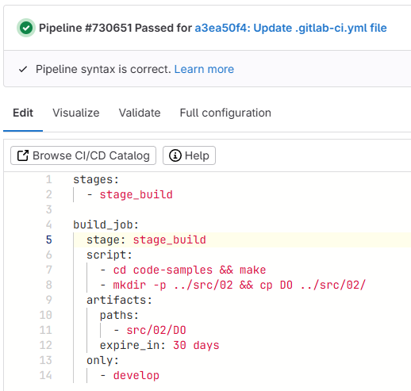

Напиши этап для **CI**, который запускает скрипт кодстайла (_clang-format_). Если кодстайл не прошел, то «зафейли» пайплайн. В пайплайне отобрази вывод утилиты _clang-format_.

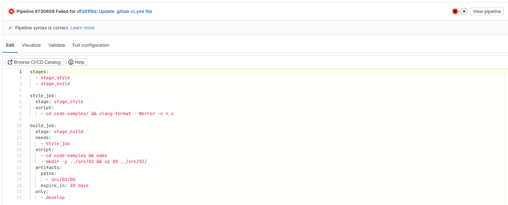

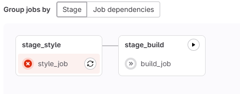

Ради интереса и проверки правильности написания скрипта решил проверить, что будет, если ошибки кодстайла не будет 

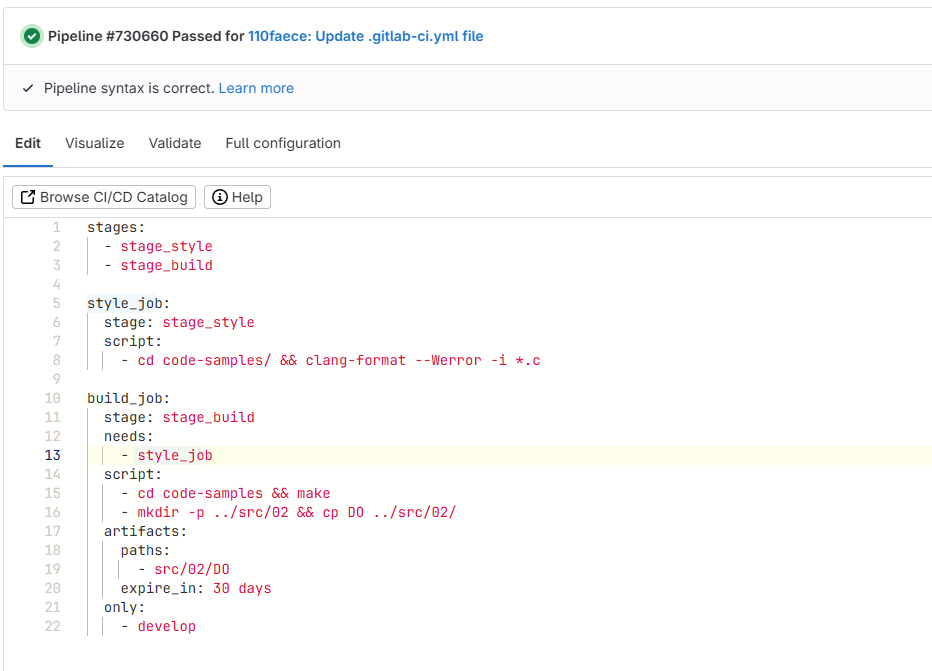

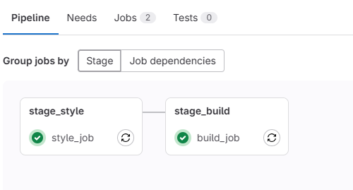

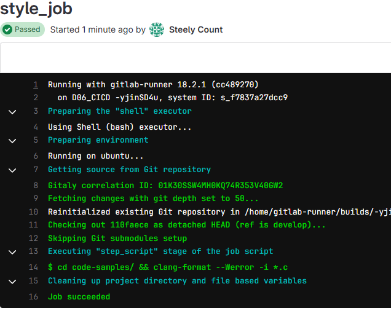

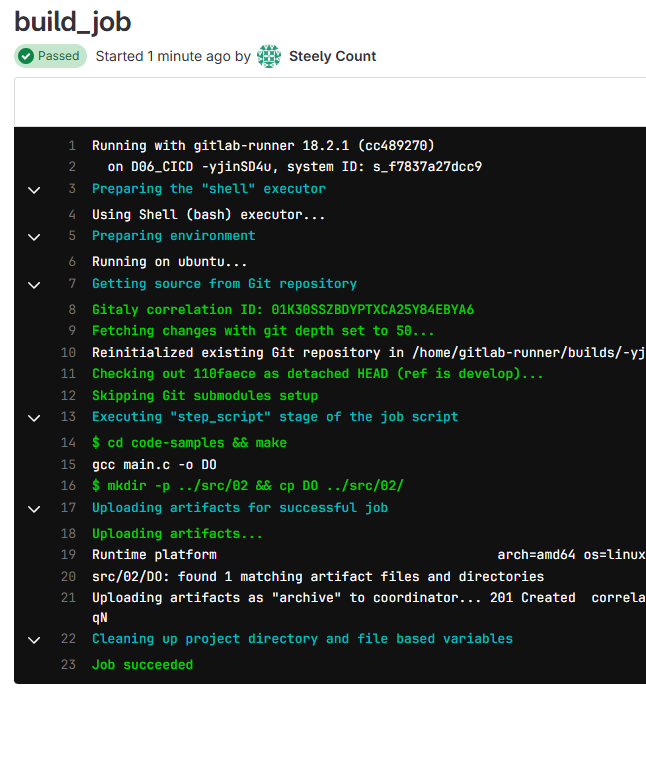

Напиши этап для **CI**, который запустит интеграционные тесты. Для проекта из папки code-samples напиши интеграционные тесты самостоятельно. Тесты могут быть написаны на любом языке (c, bash, python и т.д.) и должны вызывать собранное приложение для проверки его работоспособности на разных случаях.

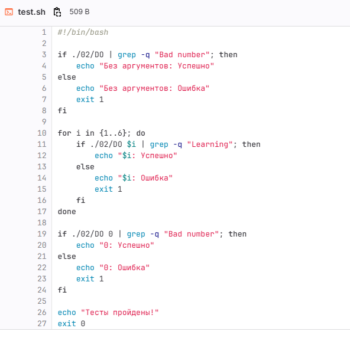

Запусти этот этап автоматически только при условии, если сборка и тест кодстайла прошли успешно. Если тесты не прошли, то «зафейли» пайплайн. В пайплайне отобрази вывод, что интеграционные тесты успешно прошли / провалились.

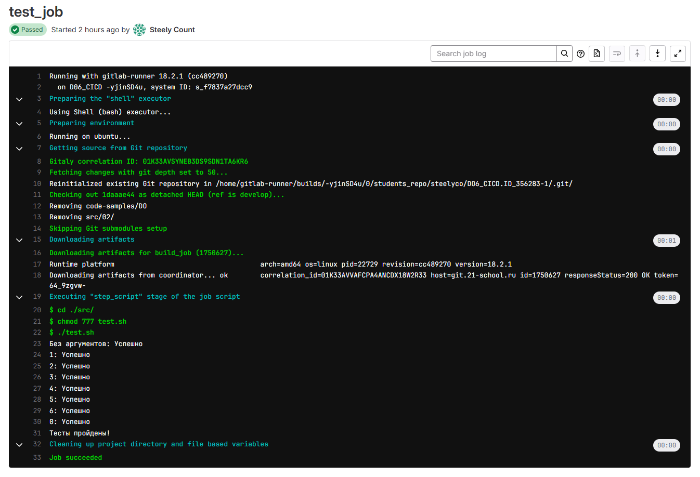

Проверил как будет себя вести пайплайн, если допустить ошибку в main.c 

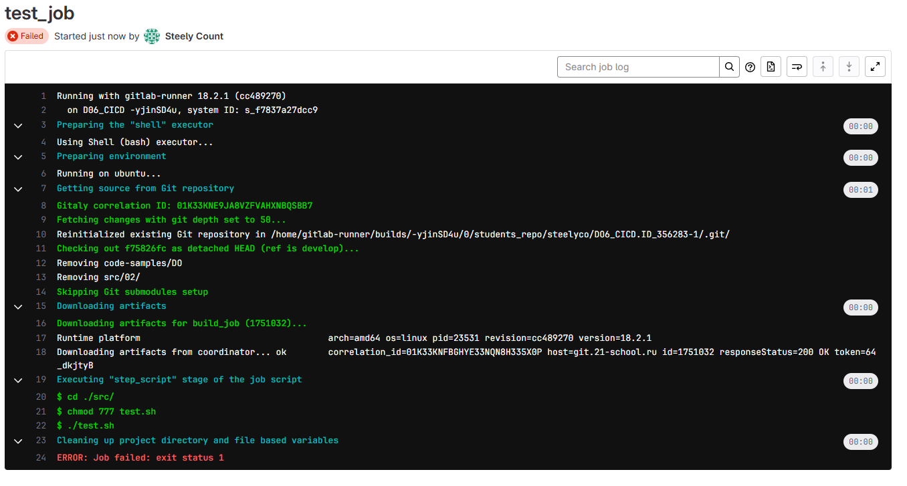

Выдается ошибка, значит, сделано всё правильно

Поднял вторую виртуальную машину _Ubuntu Server 22.04 LTS_

Напиши этап для **CD**, который «разворачивает» проект на другой виртуальной машине.
Запусти этот этап вручную при условии, что все предыдущие этапы прошли успешно.
В файле _.gitlab-ci.yml_ добавь этап запуска написанного скрипта.

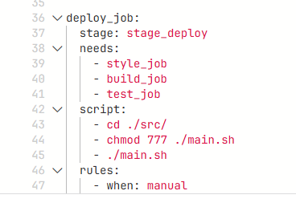

Напиши bash-скрипт, который при помощи **ssh** и **scp** копирует файлы, полученные после сборки (артефакты), в директорию _/usr/local/bin_ второй виртуальной машины.

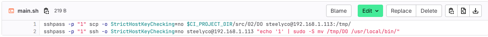

В результате ты должен получить готовое к работе приложение из папки code-samples (_DO_) на второй виртуальной машине.

Сохранил дампы образов виртуальных машин.