1. Создал с помощью Vagrant три машины: manager, node01, node02. Прокинул порты node01 на локальную машину для доступа к пока еще не развернутому микросервисному приложению.

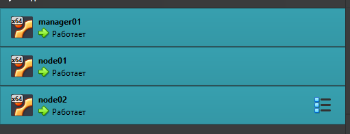

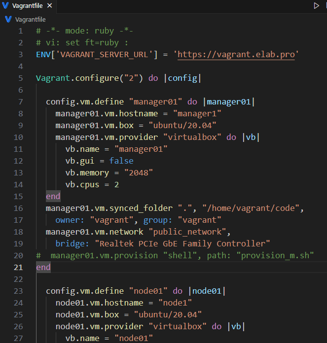

2. Подготовить manager как рабочую станцию для удаленного конфигурирования (помощь по Ansible в материалах).
    
    - Зайти на manager.
    
    
    
	- На manager проверить подключение к node01 через ssh по приватной сети.
    
	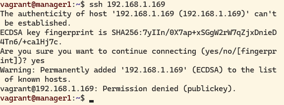

    - Сгенерировать ssh-ключ для подключения к node01 из manager (без passphrase).
    
    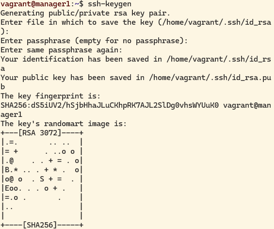
    
	
	
	- Скопировать на manager docker-compose файл и исходный код микросервисов.
	
	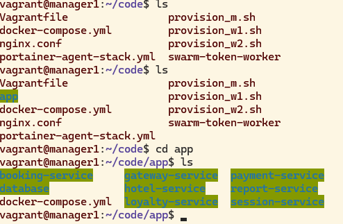
	
    - Установить Ansible на менеджер и создать папку ansible, в которой создать inventory-файл.
    
    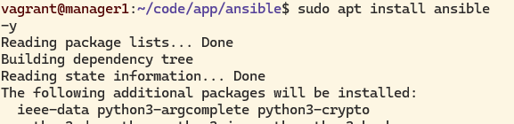
    
    
    
    
    
    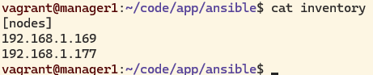
    
    - Использовать модуль ping для проверки подключения через Ansible.
    
    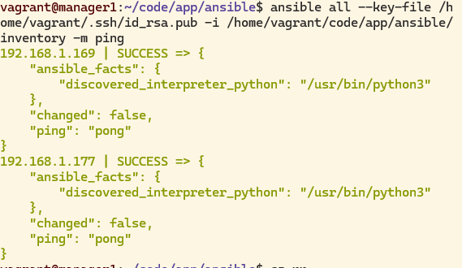

3. Написать первый плейбук для Ansible, который выполняет apt update, устанавливает docker, docker-compose, копирует compose-файл из manager'а и разворачивает микросервисное приложение. 
    
    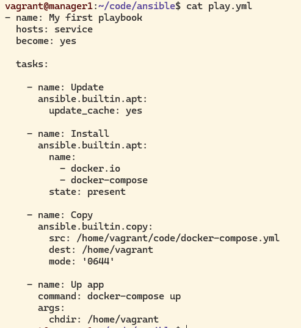
    
    
    
    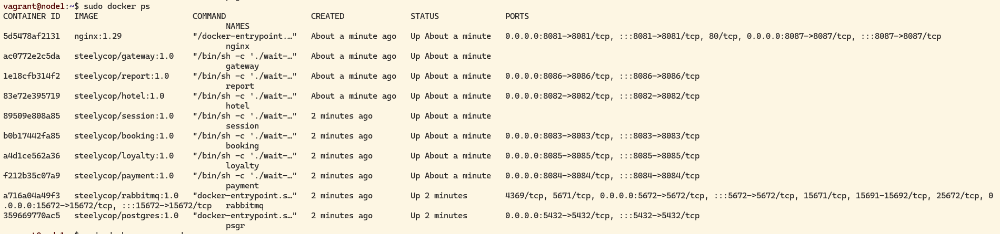
    
3. Прогнать заготовленные тесты через postman и удостовериться, что все они проходят успешно. В отчете отобразить результаты тестирования.
    
    
    
4. Сформировать три роли:
    
    - роль application выполняет развертывание микросервисного приложения при помощи docker-compose;
    - apache устанавливает и запускает стандартный apache сервер;
    - postgres устанавливает и запускает postgres, создает базу данных с произвольной таблицей и добавляет в нее три произвольные записи.
    - Назначить первую роль node01 и вторые две роли node02, проверить postman-тестами работоспособность микросервисного приложения, удостовериться в доступности postgres и apache-сервера. Для Apache веб-страница должна открыться в браузере. Что касается PostgreSQL, необходимо подключиться с локальной машины и отобразить содержимое ранее созданной таблицы с данными.
      
      
      
      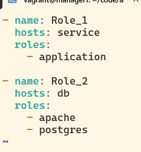
      
      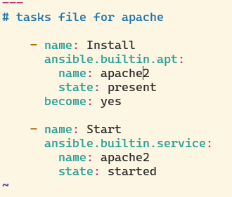
      
      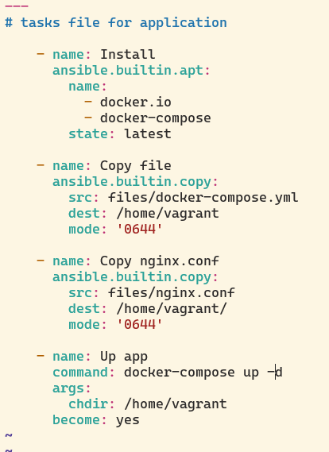
      
      
      
      
      
      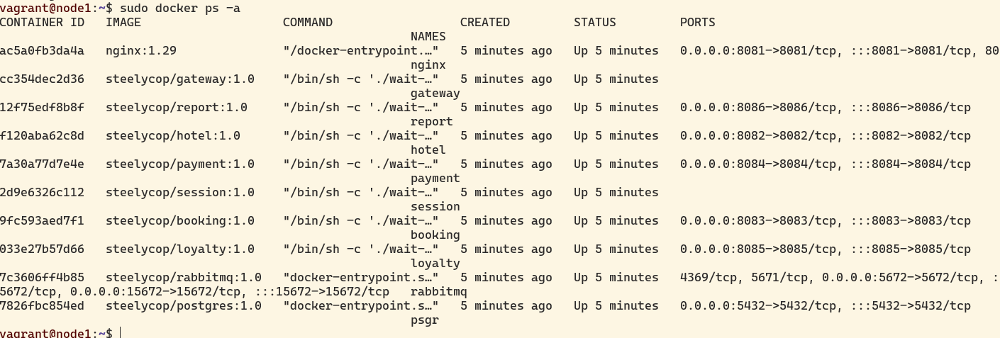
      
      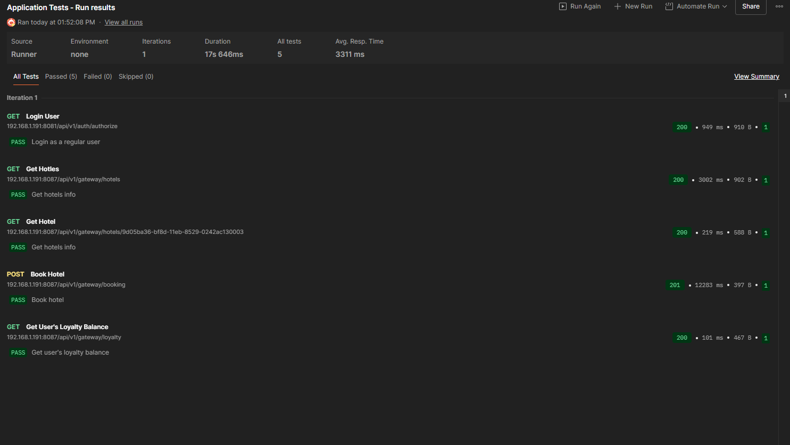
      
      
      
      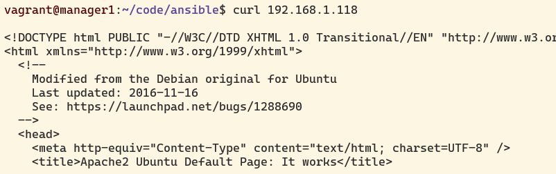
    
3. Созданные в этом разделе файлы разместить в папке `src\ansible01` в личном репозитории.

## Part 2. Service Discovery

1. Написать два конфигурационных файла для consul (информация по consul в материалах):
    
    - consul_server.hcl:
    
    
      
    - consul_client.hcl:
    
    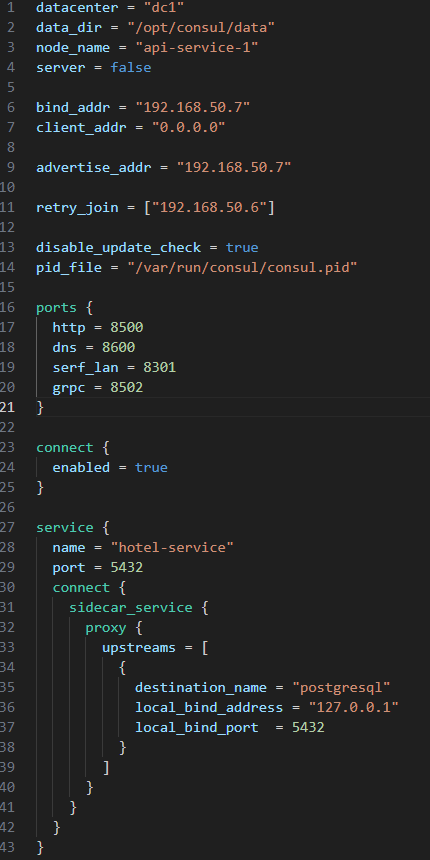
    
    
    
1. Создать с помощью Vagrant четыре машины: consul_server, api, manager и db.
    
    - Прокинуть порт 8082 с api на локальную машину для доступа к пока еще не развернутому api.
    - Прокинуть порт 8500 с consul_server для доступа к ui consul.
    
    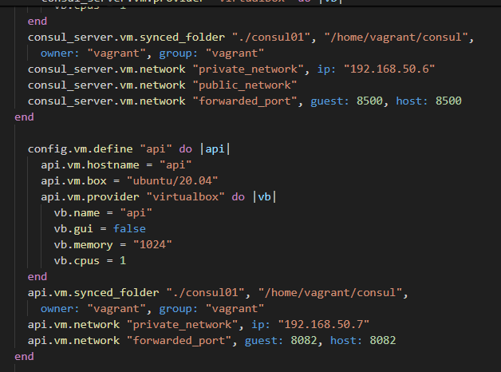
    
2. Написать плейбук для ansible и четыре роли:
    
    
    
    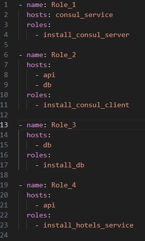
    
    - install_consul_server, которая:
    
    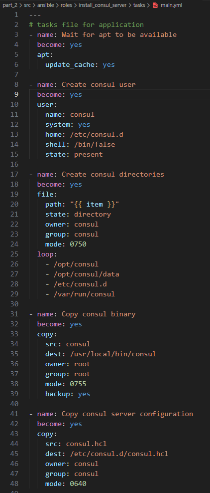
    
    
    
    - install_consul_client, которая:
    
    
    
    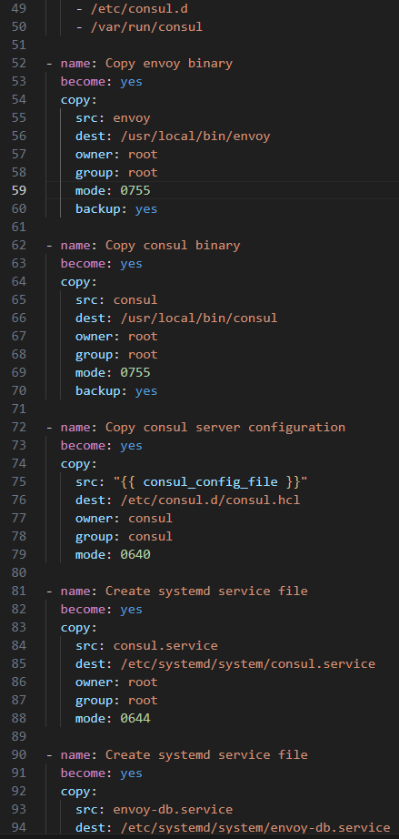
    
    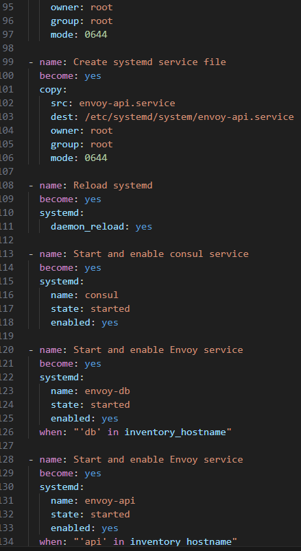
    
    - install_db, которая:
    
    
    
    - install_hotels_service, которая:
    
    

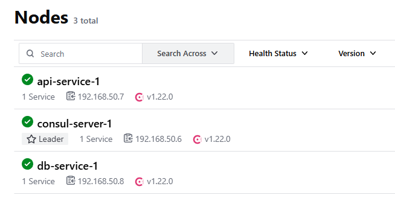

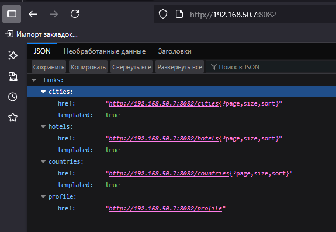

3. Проверить работоспособность CRUD-операций над сервисом отелей. В отчете отобразить результаты тестирования.

4. Созданные в этом разделе файлы разместить в папках `src\ansible02` и `src\consul01` в личном репозитории.