## Part 1. Получение метрик и логов

1. Я запустил три машины, которые использовал в 7 проекте, вместе с той конфигурацией. 
    
    
    
    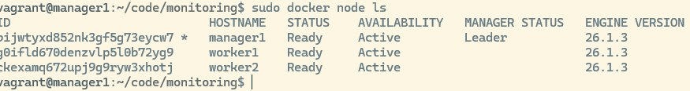
    
    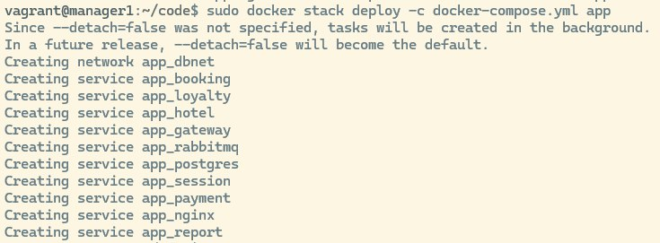
    
    Понял, что такая конфигурация не подходит, точнее образы, которые были собраны для 7 проекта, поэтому далее приступил к пересборке 
    
2. Написать при помощи библиотеки Micrometer сборщики следующих метрик приложения:
    
    Добавил новые функции в файл application.properties каждого сервиса
    
    

    

    

    

    

        

    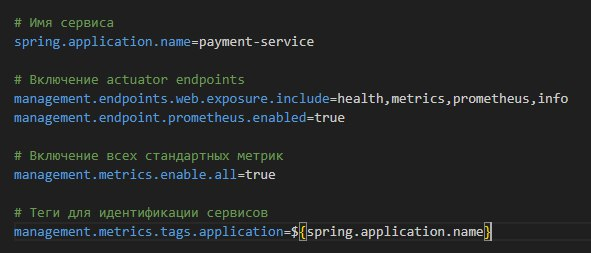

    Добавил новые зависимости в файл pom.xml
    
    
    
    Пересобрал все образы, которые использовались в 7 проекте. Теперь новые образы имеют тег 2.0 
    
    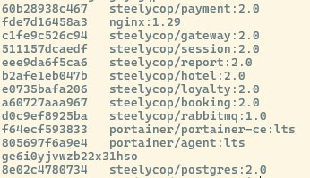
    
3. Создать новый стек для Docker Swarm из сервисов с Prometheus Server, Loki, node_exporter, blackbox_exporter, cAdvisor. Проверить получение метрик на порту 9090 через браузер.
    Для нового стека из сервисов для метрик и логов создал новые файлы:
    - monitoring.yml - файл конфигурации для деплоя стека мониторинга
    
    
    
    
    
    
    
    - prometheus.yml - файл конфигурации прометеуса
    
    
    
    
    
    - blackbox.yml - модули для blackbox'а
    
    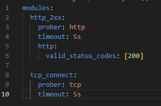
    
    - Запустил новый стек мониторинга
    
    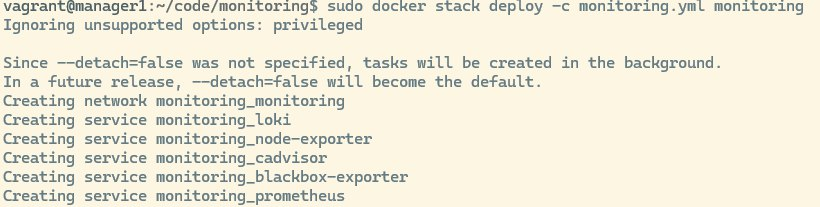
    
    - Проверяю как он работает в Portainer - все работает
    
    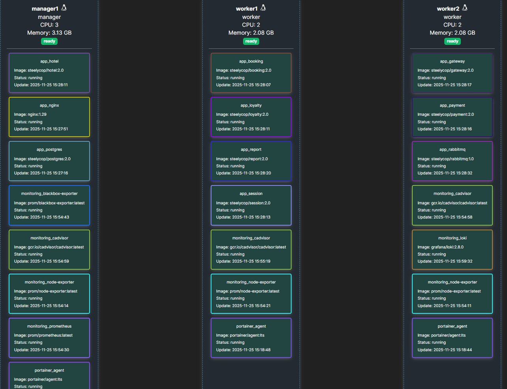
    
    - Проверяю Prometheus - все работает 
     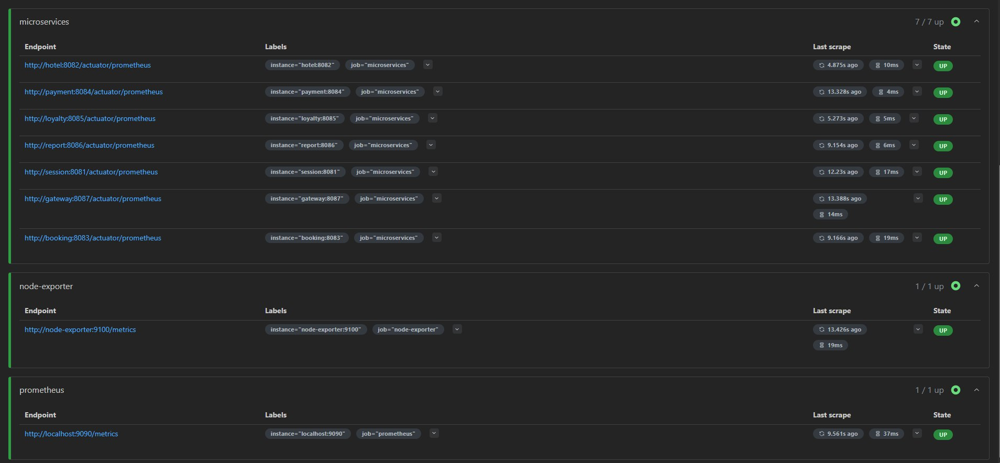
    
    
    
    - Проверяю Loki - все работает 
      
    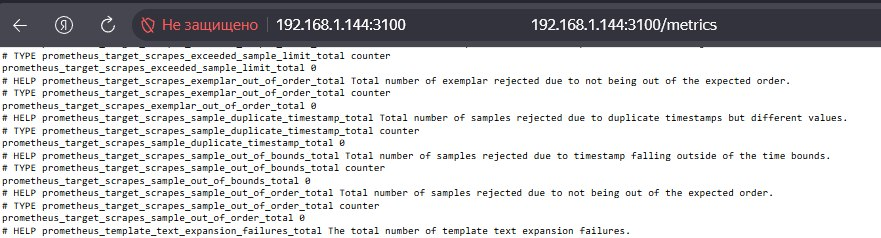

## Part 2. Визуализация

1. Развернуть grafana как новый сервис в стеке мониторинга.
   
    - Добавил в monitoring.yml блок с графаной
      
    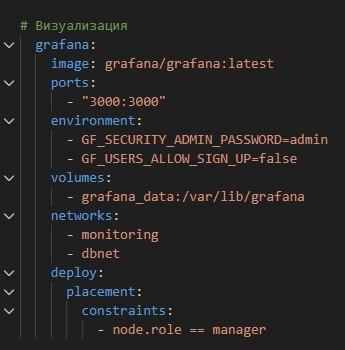
    
    - Добавил конфигурацию Loki - loki-config.yaml
    
    
    
    - Добавил Промтейл для сбора логов из контейнеров, чтобы Локи нормально работал
      
    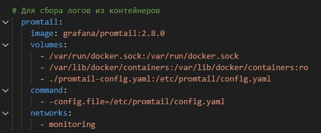
    
    - Проверил доступ в браузере - все работает
    
    
    
    Добавил в Grafana дашборд со следующими метриками:
    - количество нод;
    - количество контейнеров;
    - количество стеков;
    - использование CPU по сервисам;
    - использование CPU по ядрам и узлам;
    - затраченная RAM;
    - доступная и занятая память;
    - количество CPU;
    - доступность google.com;
    - количество отправленных сообщений в rabbitmq;
    - количество обработанных сообщений в rabbitmq;
    - количество бронирований;
    - количество полученных запросов на gateway;
    - количество полученных запросов на авторизацию пользователей;
    - логи приложения.
      
      

      

      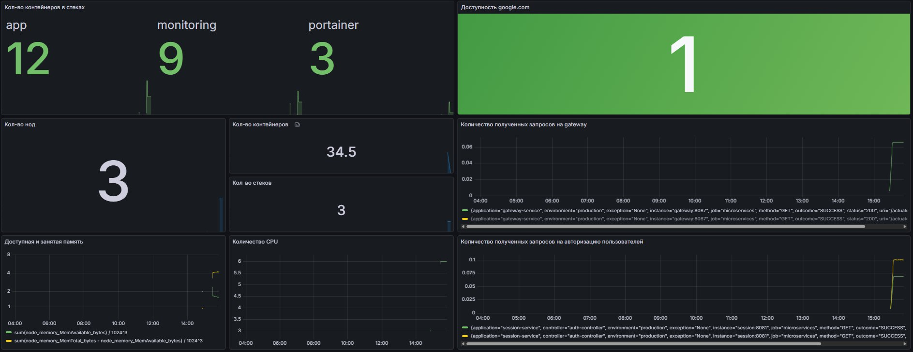
      
## Part 3. Отслеживание критических событий

1. Развернуть Alert Manager как новый сервис в стеке монтиторинга.
   
   - Добавил блок alertmanager в monitoring.yml
    
     
     
     - Создал конфигурацию alertmanager.yml
       
    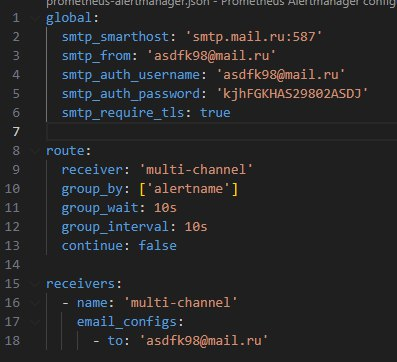
    
2. Добавить следующие критические события:

- доступная память меньше 100 Мб;
- затраченная RAM больше 1 Гб;
- использование CPU по сервису превышает 10%.

    - Создал конфигурацию самих алертов alerts.yml
    
    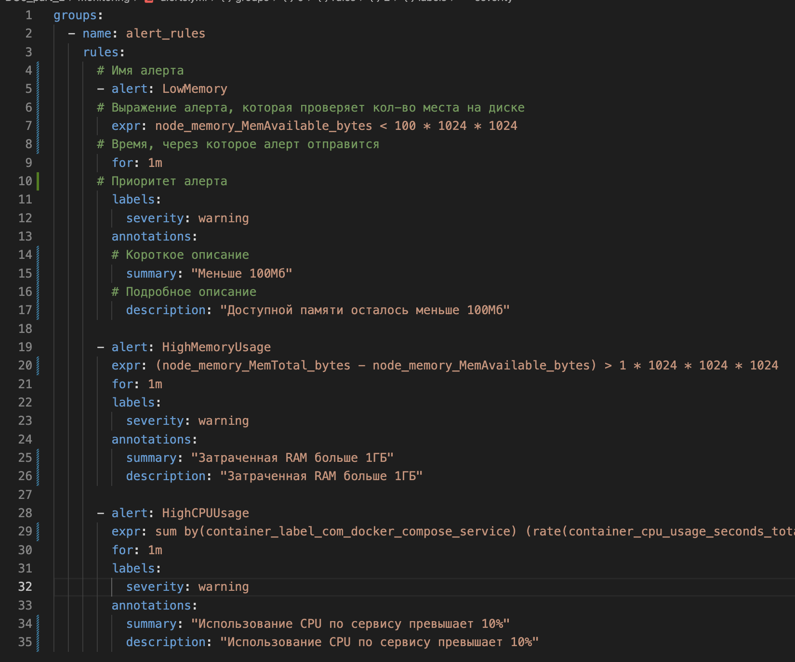

3. Настроить получение оповещений через личные email
   
    
    
    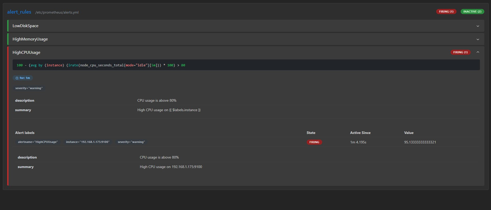
    
    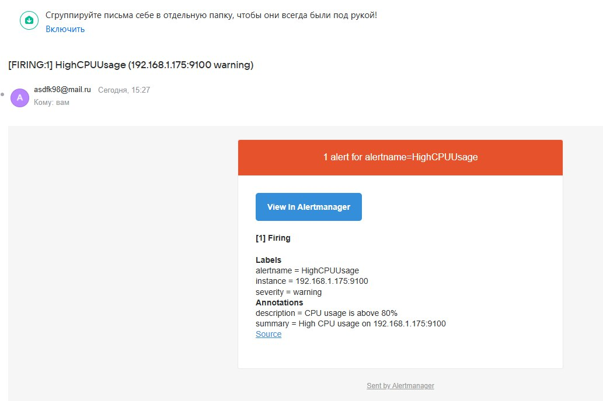
    
    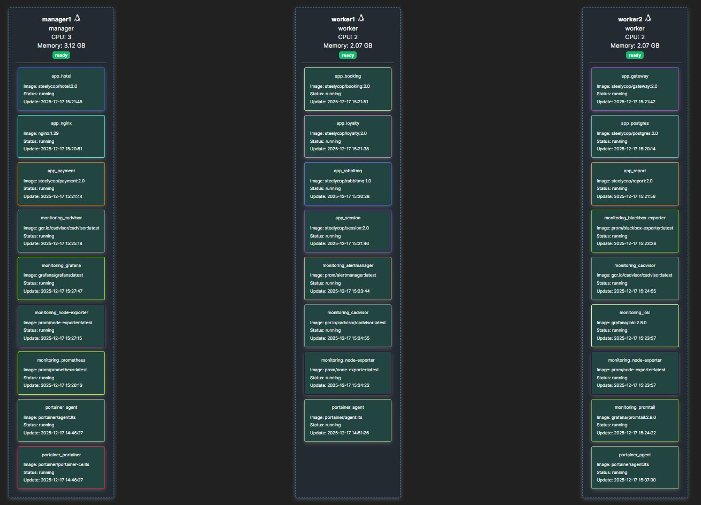